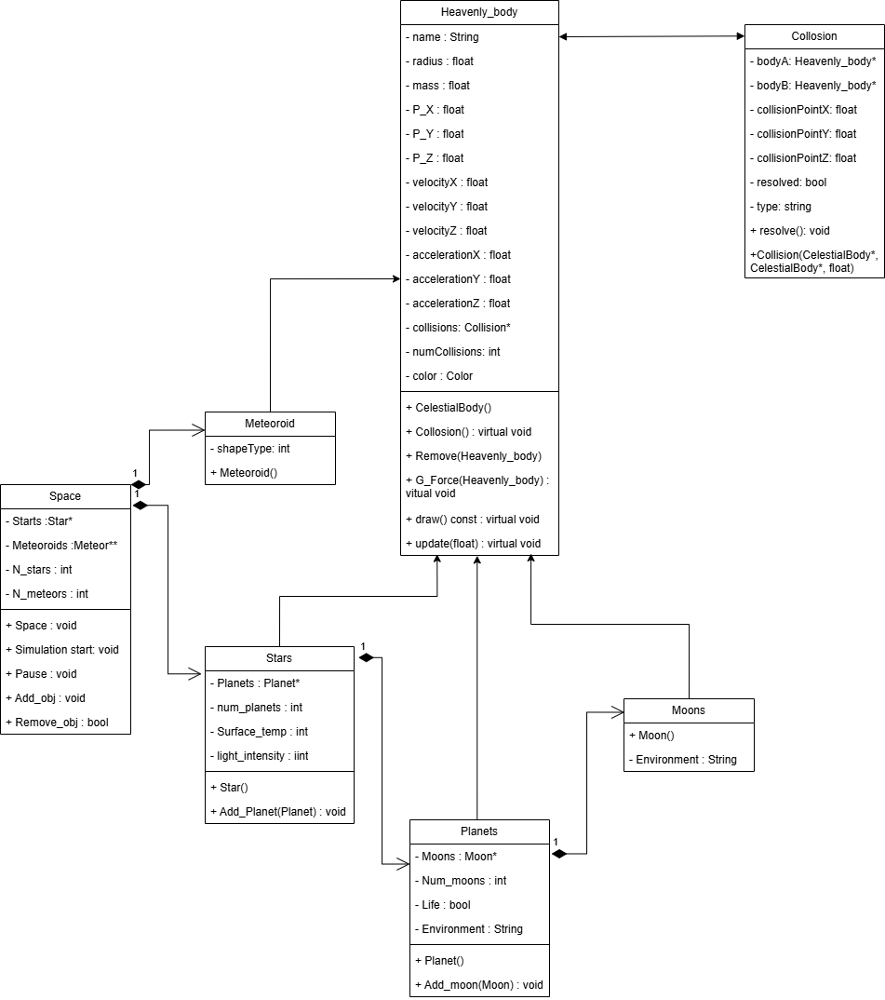
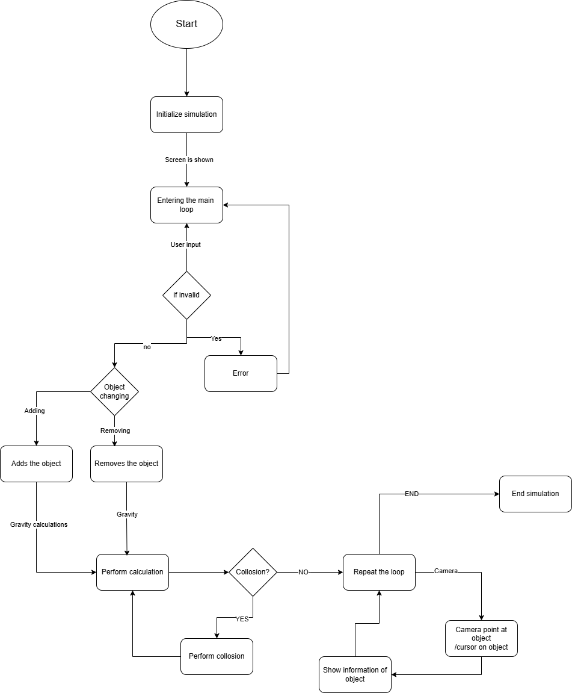

# Gravity-simulation

Its a program where we simulate Newtonian Gravity Between given Heavenly object.
A 3D simulation of a solar system built in C++ using Raylib, modeling celestial bodies such as stars, planets, moons, and meteoroids. It features Newtonian gravity, collisions, camera movement, and a dynamic environment.

I have made this diagram considering the things i know could be codded properly.If while coding i discover more functions of raylib that could enhance this project i will do my best to add those features as well but now the projevt is only in its intitial stages so there could be a lot of area for improvement.
The code starts with a few heavenly objects as default created in the space,the user can add or delete these objects.
The camera is controlled by the user and user can move around this space. When user focuses on an object through a camera ,the features/attributes of that heavenly body are shown and user can see its given name and input the command to delete/modify said object.
When the object collide their collision is also simulated in the Space.
The work flow diagram is as follow:

